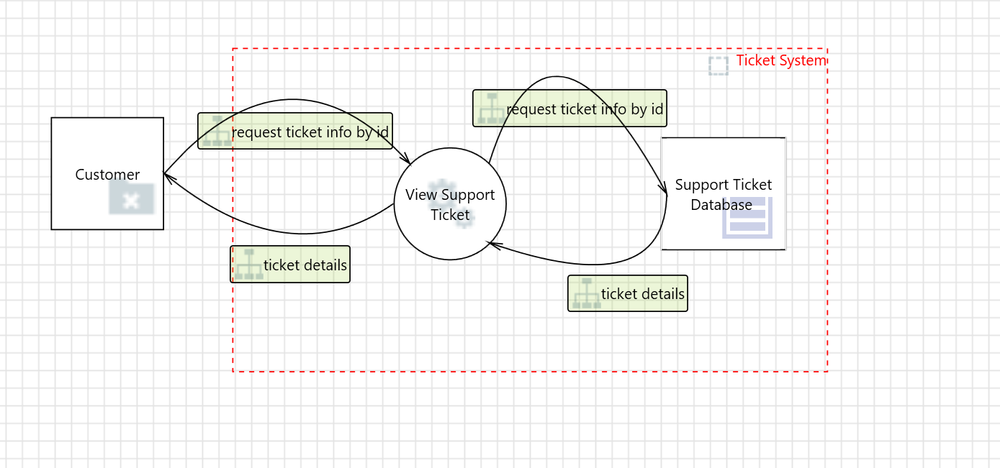

# Exercise 1 – Threat Elicitation for a Support Portal

## 1. Problem Description

A company provides a web-based **Customer Support Portal** where logged-in users can create support tickets and view their ticket history.

The system identifies tickets using a simple numerical parameter in the URL:

```
https://support.example.com/ticket/view?id=1001
```

If authorization validation is missing, users may manipulate the parameter to access tickets belonging to other users.

---

## 2. Data Flow Diagram (DFD)



[Download the Threat Model](support_portal_threat_model.tm7)

### DFD Components

| Component | Description |
|---|---|
| External Entity | Customer (User interacting with the portal) |
| Process | View Support Ticket – retrieves and displays ticket data |
| Data Store | Support Ticket Database containing all tickets |
| Data Flow | Request containing the `id` parameter and response containing ticket details |
| Trust Boundary | Between the user's browser (untrusted environment) and the backend server |

---

# 3. Specific Threat Challenge

Instructions for Students:
1.	Locate the Vulnerability: Identify where the system fails to validate authorization when data crosses the Trust Boundary.
2.	Analyze the Mechanism: Explain how an attacker can manipulate entry points (like query parameters) to access data they should not have access to.

---

# 4. Threat Enumeration (Student)

| Field | Description |
|------|-------------|
| Actor (Threat Source) | |
| Prerequisites | |
| Actions | |
| Consequence | |
| Affected System Component | |
| Impact | |

---

# 5. Solution Example

| Field | Description |
|------|-------------|
| Actor | An authenticated malicious user with legitimate access to the portal, but with the intent to access others' data.|
| Prerequisites | Legitimate access to the portal |
| Actions | Modify the `id` parameter in the request |
| Consequence | Access to other users’ tickets |
| Component | View Support Ticket process |
| Impact | Confidentiality breach exposing personal information |